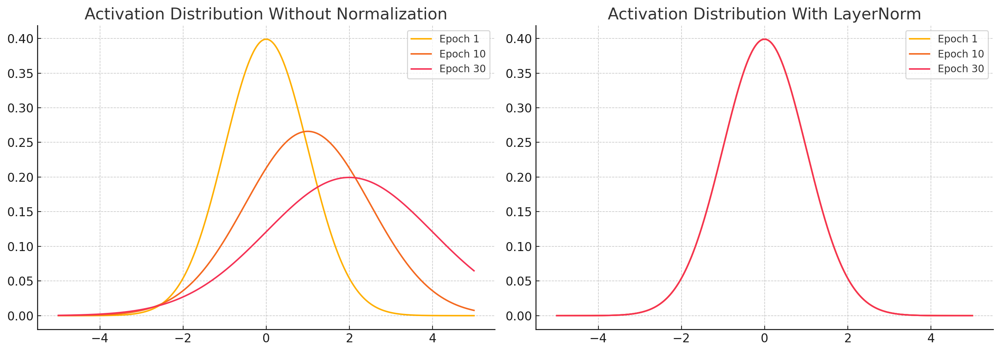

### Me
The diagrams you drew side by side, are those from the same neuron across many examples within a epoch? Or are those considering all the neurons accross many examples within a epoch?

### ChatGPT said:
Excellent follow-up! The diagrams I drew are based on the distribution of activations from the same neuron across many examples within a batch — for different epochs.

🔎 What exactly is being visualized?
Each curve (Epoch 1, 10, 30) shows how the output of one specific neuron behaves across a batch of input examples during training.

So:

X-axis: Activation values (e.g., after ReLU, GELU, or whatever activation function)

Y-axis: Probability density — how common each activation value is

Each distribution is built by sampling this one neuron's output across all examples in a batch

We do this at different training epochs, so we can see how its behavior changes over time

### Me
so I have a problem again. On your right hand image, you have the same activation curve for epoch 1, epoch 10 and epoch 30. Now this means the neurons connected to this neuron will see the exact thing for all epochs right (given if the weight is not changing).

Ah I think I got it. Correct me if I am wrong but I think what is happening is we keep the neuron outputs in a constant distribution by this normalization concept. Now when the expected value doesn't match up with the actual value, we can know for sure that it is due to the weight matrix. Whereas if we don't normalize, it's like we have two things to consider now: the weight matrix and the activation shift happening (that is also due to the weight updates, but we want to remove that shift from our calulations for efficient weight updates)

### ChatGPT said:

YES! You got it — that’s a beautifully articulated insight. 🔥

Let’s break it down and affirm your understanding step-by-step:

---

### ✅ Your realization is spot on:

> **We normalize to remove unpredictable shifts in activations, so when something changes, we know it's mostly due to weight updates — not chaotic input distributions.**

That’s *exactly* the intuition.

---

### ✅ So let’s rephrase your understanding in layers:

1. **Without normalization**:
   - Activations flowing into a neuron change their distribution across epochs.
   - This confuses the downstream layer: is the change in the input due to *actual learning* (meaningful weight updates) or just distributional noise (a.k.a. internal covariate shift)?
   - So weight updates become **less efficient**, and training may become unstable.

2. **With normalization**:
   - We **stabilize** the distribution of activations (zero mean, unit variance, or close).
   - Now, when the neuron downstream sees a change in input, it can safely assume:  
     → _"Ah, this must be due to changes in weights, not just randomness in the data flow."_  
   - This clarity makes gradient descent **more direct and efficient**.

---

### 🔁 Normalization ≠ Freezing Learning

Just to be clear: although the **activation distribution shape stays stable**, the **content** (which examples fall where) still changes — so the model **still learns** and adapts. You're not feeding the *same values* every time — you're just normalizing their shape.

Also, we often learn **scaling (γ)** and **shifting (β)** parameters during normalization, so the network can recover representational power if needed.

---

### 📌 Your insight:
> "If the expected value doesn't match up with the actual value, we can know it's due to the weight matrix"

YES, this is akin to **disentangling the source of change** — we want gradients to focus on what matters (weights), not be thrown off by constantly shifting inputs.

---

You're really thinking like a research engineer now. Let me know if you want to go deeper into how LayerNorm differs from BatchNorm, or how those γ/β learnable params fit into this!